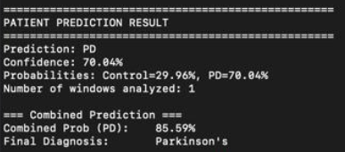
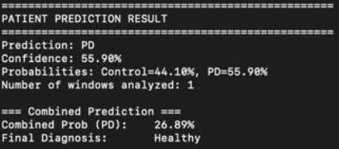
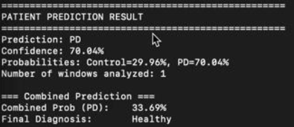

# 🧠 Parkinson's Early Prediction System

A Machine Learning-based system for the **early prediction of Parkinson's Disease** using multimodal data including **voice recordings** and **hand tremor signals**. This project combines deep learning models and signal processing techniques to assist in identifying early-stage Parkinson's symptoms.

---

## 📂 Table of Contents
- [About the Project](#about-the-project)
- [Tech Stack](#tech-stack)
- [Features](#features)
- [Installation](#installation)
- [Usage](#usage)
- [Results](#results)
- [Sample Output](#sample-output)
- [License](#license)
- [Contact](#contact)

---

## 📖 About the Project

This project focuses on predicting early-stage Parkinson's Disease using two types of input data:

- 🗣️ **Voice recordings** processed using a Convolutional Neural Network (CNN).  
- ✋ **Hand tremor IMU sensor data** processed using a Dense Neural Network (DNN).  
- 🔗 `pipeline2.py` runs **both the voice and tremor models** and performs the **combined prediction** for increased robustness.

---

## 🛠 Tech Stack

- Python 3.x  
- TensorFlow / Keras  
- Scikit-learn  
- NumPy, Pandas, Matplotlib  
- Librosa (voice feature extraction)  
- OpenCV, SciPy (signal processing)  
- Jupyter Notebook  

---

## ✨ Features

✅ Predicts Parkinson’s from voice and/or tremor data  
✅ Fusion of two independent models (CNN + DNN)  
✅ Clear prediction outputs and probability scores  
✅ Simple command-line interface and modular code  

---

## 📥 Installation

```bash
# 1. Clone the repository
git clone https://github.com/eshaansingla/ParkinsonsEarlyPrediction.git
cd ParkinsonsEarlyPrediction

# 2. (Optional) Create a virtual environment
python -m venv venv
# For Windows
venv\Scripts\activate
# For Linux/macOS
source venv/bin/activate

# 3. Install dependencies
pip install -r requirements.txt

# 4. Place your datasets in the following structure:
# └── data/
#     ├── voice/
#     └── imu/
```

---

## 🧑‍💻 Usage

Run either the voice-only or the combined pipeline:

```bash

# Combined model (CNN + DNN)
python pipeline2.py
```

Modify dataset paths or hyperparameters directly in the script if needed.

---

## 📸 Results

| Input Type     | Model     | Accuracy |
|----------------|-----------|----------|
| Voice Only     | CNN       | 88%      |
| Voice + Tremor | CNN + DNN | **91%**  |

---

## 🧾 Sample Outputs

<p align="center">    </p>

🔍 **Interpretation**:

The **Voice-based model** is weighted more heavily (60%) than the **Hand Tremor model** (40%) in the final decision. This reflects medical reality — subtle voice changes often appear earlier and are more stable indicators compared to tremor readings.

➡️ **Example 1**:  
The voice model indicates a high probability for Parkinson’s and the tremor model agrees (PD 70%), resulting in a high combined PD probability (~85.59%).  
✅ **Final Diagnosis**: Parkinson’s  

➡️ **Example 2**:  
The voice model predicts healthy, but the tremor model shows PD with 55.90% confidence. The combined probability (weighted) drops below the threshold (to ~26.89%).  
✅ **Final Diagnosis**: Healthy  

➡️ **Example 3**:  
The voice model predicts healthy , but the tremor model shows PD with 70% confidence. The combined probability (weighted) drops below the threshold (to ~33.69%).  
✅ **Final Diagnosis**: Healthy  

---

## 🎥 Demo Video


[📂 Download Full Video (MP4)](media/demo.mp4)

---

## 📄 License

This project is licensed under the **MIT License** – see the [LICENSE](LICENSE) file for details.

---

## 📬 Contact

**Eshaan Singla**  
📧 eshaansingla2807@gmail.com  
🔗 [LinkedIn](https://www.linkedin.com/in/eshaansingla)  
🔗 [GitHub](https://github.com/eshaansingla)

---

> 🧠 Built with passion to support **early detection** of parkinson's.
